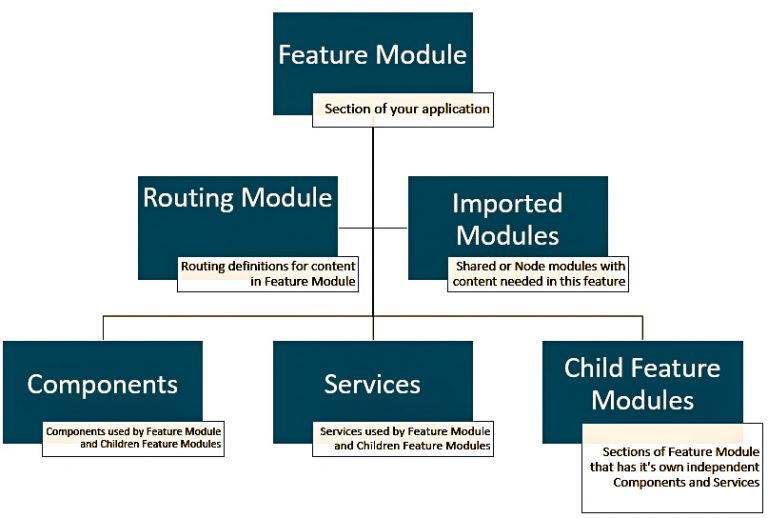

# Angular6


Vou colocar um resumo sobre o que venho estudando a respeito do Angular6.

## Instalando o angular cli.
````bash
npm install -g @angular/cli
````

## Para criar um novo projeto com o angular cli.
````bash
ng new <project_name> --routing --style=scss
````

## Como gerar Modules, Componentes, Directives e Services.

+ **--spec** faz com que se true seja criado o arquivo .spec.ts para os testes.
+ **--inline-template** faz com que o componente ou diretiva tenha o template (.html) inline ou seja dentro do arquivo .ts
+ **--inline-style** faz com que o componente ou diretiva tenha o style (.scss) inline ou seja dentro do arquivo .ts
+ **--routing** ___ falta colocar ___

### **Modulos**
````bash
ng g m <folder/name_module> --spec=false --routing
````

### **Componentes***
````bash
ng g c <folder/name_component> --spec=false --inline-style --inline-template
````

Ao gerar um novo componente, diretiva, modulo ou serviço podemos escolher qual será a estrutura de pastas ao usar o folder/name_componente, o novo componente criado vai estar dentro da pasta seguindo a estrutura folder/name_component [ .ts, .scss, .html].

### O que é Angular Module?

Angular Module é a declaração para tudo que será usado ou que você precisa em uma seção da aplicação, um exemplo claro é o **app.module.ts** presente
em todas aplicações geradas pelo angular-cli.

````ts
import { BrowserModule } from '@angular/platform-browser';
import { NgModule } from '@angular/core';

import { AppRoutingModule } from './app-routing.module';
import { AppComponent } from './app.component';

@NgModule({
  declarations: [
    AppComponent
  ],
  imports: [
    BrowserModule,
    AppRoutingModule
  ],
  providers: [],
  bootstrap: [AppComponent]
})
export class AppModule { }

````
Quando definimos o Angular Module como uma declaração para tudo que será usado ou que você precisa em uma seção da aplicação, ficamos com algumas dúvidas como o que declaramos para essa seção? o que devemos dizer que o app precisa? no arquivo **app.module.ts** estamos declarando o AppComponent literalmente, com o que ele precisa para funcionar, todos os componentes da aplicação precisam ser declarados no Angular Module para estarem disponíveis para uso, outro fato é a importação do BrowserModule que é uma classe necessária para o uso do ng module para o browser de acordo com a documentação do [Angular](https://angular.io/api/platform-browser/BrowserModule).

Se acessarmos o arquivo **main.ts** podemos ver o AppModule sendo importado e note que o AppModule está sendo provido pelo método de bootstrap que importa o AppComponent como um elemento do array e ele informa qual componente deve ser bootstraping, o platformBrowserDynamic é importado do mesmo pacote do BrowserModule  se não tivessemos importado o BrowserModule no AppModule não seria possível acessar o platformBrowserDynamic porque ele seria desconhecido.
````ts
import { enableProdMode } from '@angular/core';
import { platformBrowserDynamic } from '@angular/platform-browser-dynamic';

import { AppModule } from './app/app.module';
import { environment } from './environments/environment';

if (environment.production) {
  enableProdMode();
}

platformBrowserDynamic().bootstrapModule(AppModule)
  .catch(err => console.error(err));

````	
esse é um exemplo básico do uso do Angualar Modules, declaramos partes essenciais da aplicação no AppModule e importamos o mesmo para que a aplicação faça bootstrap, com isso temos todos os recursos necessários imortados no Module e disponivel para toda a seção da aplicação.

Quando formos usar a estrutura de modulos do Angular, devemos manter a imagem abaixo em mente.



Essa estrutura ajuda a facilitar qualquer manutenção mantendando cada parte do sistema separada por modulos.

### Feature, Shared e Core Modules.

Dependendo do tamanho e complexidade do projeto, você talvez use tudo dentro do AppModule, colocando todas as declarações lá, contudo se a aplicação for maior ou ficar maior é extremamente recomendado o uso do Core, Shared e Feature Modules. Ao fazer isso estamos garantindo a separação adequada de cada funcionalidade, com isso temos uma aplicação escalável a seguir vamos explicar como funciona cada um desses modulos.

- **Feature Module**
    - Feature module é um module com todo o conteúdo que vamos encapsular dentro de uma única área.
    - Applicações devem ter multiplos feature modules.
    - Imagine um feature module como uma aplicação independente dentro da sua aplicação completa.
    - Feature Module representa uma seção, normalmente tem um componente raiz que o exporta e é usado por um modulo pai, todas as outras partes desse recurso serão colocadas em um componente raiz.

- **Shared Module**
    - O Shared Module server para partes da aplicação que precisam ser usadas por muitas áreas ou recursos da aplicação.
    - Se um componente está sendo usado por muitos recursos declare esse componente no shared module.
    - Services e Pipes são normalmente declarados no shared modules.
    - Shared Modules não precisam necessariamente seguir uma seção, a ideia é colocar tudo e prover como algo compartilhado para todos.

- **Core Module**
    - O Core Module é uma ótima maneira de separar cada camada da aplicação, com ele podemos separar tudo em modulos e cada um tem o seu Core.
    - Devemos declarar todos os Features e Shared Modules no Core Module e prover o Core Module para o AppModule.
    - Para tudo que precisamos que seja usados em todos os Feature Modules devemos declarar no Core Module.
    - Imagine o Core Module como pai do Feature Module para todo o conteúdo que estamos adicionando a aplicação.

### Exemplo de aplicação.
